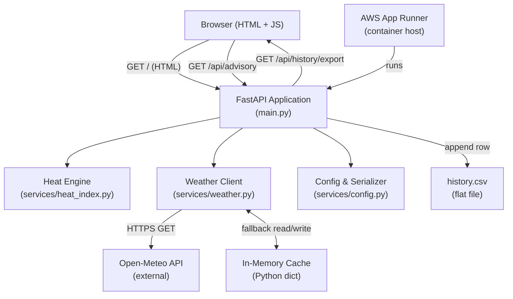
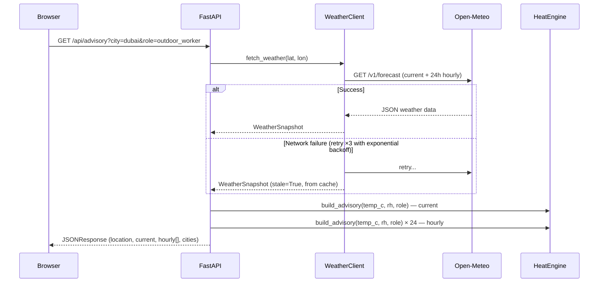

# HeatSafe — Technical Design Document

## Overview

HeatSafe is a Hyperlocal Climate & Heat-Stress Advisory Engine that transforms raw weather data into actionable, physiological safety guidance for outdoor workers and heat-vulnerable community members. Standard weather applications report ambient temperature, which correlates poorly with physiological heat stress. HeatSafe addresses this gap by applying the NOAA Rothfusz regression to compute the apparent heat index, classifying risk into four OSHA-aligned safety bands, and surfacing role-specific micro-advisories through a responsive single-page dashboard.

The system is intentionally narrow in scope for the hackathon: a single Python (FastAPI) backend, a server-rendered Jinja2 HTML frontend, and deployment to AWS App Runner via a single Dockerfile. There are no databases, no user accounts, and no authentication — complexity is deliberately kept low to maximise reliability and deployability.

### Key Design Decisions

| Decision | Choice | Rationale |
|---|---|---|
| Weather data source | Open-Meteo (free, no API key) | Zero friction for hackathon judges to deploy |
| Heat index algorithm | NOAA Rothfusz regression (pure Python) | Authoritative, well-documented, no dependencies |
| Frontend rendering | Jinja2 SSR + vanilla JS + Tailwind CDN | Single template file, no build step needed |
| Persistence | In-memory cache (dict) + CSV flat file | Sufficient for 30-day MVP; no database required |
| Deployment | AWS App Runner via Dockerfile | Single command deploy, auto-scales, built-in health checks |

---

## Architecture

HeatSafe follows a simple layered architecture with three runtime layers and a thin persistence tier.



### Request Flow — Advisory Endpoint



---

## Components and Interfaces

### 1. `main.py` — FastAPI Application

The top-level ASGI application. Wires together all services and defines the three HTTP endpoints.

**Endpoints:**

| Method | Path | Description |
|---|---|---|
| `GET` | `/` | Server-rendered dashboard (Jinja2 template) |
| `GET` | `/api/advisory` | JSON advisory for current + 24h hourly forecast |
| `GET` | `/api/health` | Health check for App Runner container orchestration |
| `GET` | `/api/history/export` | Download historical data as CSV |

**`GET /api/advisory` query parameters:**

| Parameter | Type | Default | Description |
|---|---|---|---|
| `city` | `str` | `"phoenix"` | Preset city key (e.g., `dubai`, `chennai`) |
| `lat` | `float` | — | Latitude (used when `city` is absent) |
| `lon` | `float` | — | Longitude (used when `city` is absent) |
| `role` | `str` | `"general_public"` | `outdoor_worker` or `general_public` |

**`GET /api/advisory` response schema (`AdvisoryResponse`):**

```json
{
  "location": {
    "name": "Dubai, UAE",
    "latitude": 25.2048,
    "longitude": 55.2708
  },
  "role": "outdoor_worker",
  "stale_data": false,
  "current": {
    "temperature_c": 38.2,
    "relative_humidity": 65.0,
    "wind_speed_kmh": 12.5,
    "heat_index_c": 48.1,
    "heat_index_f": 118.5,
    "band": "Extreme Danger",
    "risk_level": "Extreme",
    "color": "darkred",
    "work_rest_ratio": "Stop all outdoor work immediately",
    "hydration_l_per_hr": 1.0,
    "micro_advisory": ["Stop all outdoor work immediately...", "..."]
  },
  "hourly": [
    {
      "time": "2024-07-15T09:00",
      "temperature_c": 36.5,
      "relative_humidity": 60.0,
      "heat_index_c": 45.2,
      "heat_index_f": 113.4,
      "band": "Extreme Danger",
      "risk_level": "Extreme",
      "color": "darkred"
    }
  ],
  "cities": { "dubai": { "name": "Dubai, UAE", "lat": 25.2048, "lon": 55.2708 } }
}
```

---

### 2. `services/heat_index.py` — Heat Engine

A pure-Python module with no I/O side effects. All functions are deterministic given the same inputs. This is the computational core of HeatSafe.

**Public API:**

| Function / Class | Signature | Description |
|---|---|---|
| `calculate_heat_index_f` | `(temp_f: float, rh: float) → float` | NOAA Rothfusz HI in °F |
| `calculate_heat_index_c` | `(temp_c: float, rh: float) → float` | NOAA Rothfusz HI in °C |
| `classify_heat_index` | `(hi_f: float) → SafetyBand` | Maps HI to NOAA safety band |
| `get_micro_advisory` | `(band: str, role: Role) → list[str]` | Role-specific advisory messages |
| `build_advisory` | `(temp_c: float, rh: float, role: Role) → HeatAdvisory` | Full advisory as a single call |
| `celsius_to_fahrenheit` | `(temp_c: float) → float` | Unit conversion |
| `fahrenheit_to_celsius` | `(temp_f: float) → float` | Unit conversion |

**NOAA Rothfusz Logic:**
The implementation uses a two-stage approach:
1. A simple Steadman-based formula is computed first. If the average of this result and the ambient temperature is below 80°F, the simple result is returned directly (no need for the full regression).
2. For conditions above 80°F, the full 9-term Rothfusz polynomial is applied with two conditional adjustments: a low-humidity correction (RH < 13%, temp 80–112°F) and a high-humidity correction (RH > 85%, temp 80–87°F).

**Classification thresholds (per NOAA / requirements):**

| Upper bound (°F, exclusive) | Band | Risk Level | Color |
|---|---|---|---|
| 80 | Normal | Low | green |
| 91 | Caution | Moderate | yellow |
| 103 | Extreme Caution | High | orange |
| 125 | Danger | Extreme | red |
| ∞ | Extreme Danger | Extreme | darkred |

---

### 3. `services/weather.py` — Weather Client

Async HTTP client wrapping the Open-Meteo free API. Handles retry logic, caching, and data parsing.

**Public API:**

| Function | Signature | Description |
|---|---|---|
| `fetch_weather` | `(latitude: float, longitude: float) → WeatherSnapshot` | Fetch current + 24h hourly |
| `get_city_coordinates` | `(city_key: str) → dict \| None` | Preset city lookup |

**Retry behaviour:**
- Up to `MAX_RETRIES = 3` attempts
- Exponential backoff: `0.5s`, `1.0s`, `2.0s`
- On full exhaustion: returns the last cached `WeatherSnapshot` with `stale=True`, or raises `RuntimeError` if no cache is available

**Open-Meteo request parameters:**
```
latitude, longitude,
current=temperature_2m,relative_humidity_2m,wind_speed_10m,
hourly=temperature_2m,relative_humidity_2m,
forecast_days=2, timezone=auto
```
The hourly slice is trimmed to the 24 hours starting from the current forecast hour.

---

### 4. `services/config.py` — Configuration Parser & Data Serializer *(to be created)*

This module centralises all configuration loading and data serialisation logic, satisfying Requirements 9.

**Configuration sources (priority order, highest first):**
1. Environment variables
2. JSON configuration file (city presets)
3. Hard-coded safe defaults

**Environment variables:**

| Variable | Default | Description |
|---|---|---|
| `OPEN_METEO_URL` | `https://api.open-meteo.com/v1/forecast` | API base URL |
| `MAX_RETRIES` | `3` | HTTP retry limit |
| `BASE_BACKOFF_SECONDS` | `0.5` | Base delay for exponential backoff |
| `CACHE_TTL_SECONDS` | `300` | Staleness threshold for in-memory cache |
| `HISTORY_FILE_PATH` | `./history.csv` | Path for historical CSV storage |
| `CITY_CONFIG_PATH` | `""` | Optional path to JSON city definitions file |

**City JSON format (`CityConfig`):**
```json
[
  { "key": "dubai", "name": "Dubai, UAE", "lat": 25.2048, "lon": 55.2708 }
]
```

**Public API:**

| Function | Signature | Description |
|---|---|---|
| `load_config` | `() → AppConfig` | Load and validate all configuration |
| `parse_city_config` | `(json_str: str) → list[CityConfig]` | Parse city JSON |
| `serialize_advisory` | `(advisory: HeatAdvisory) → dict` | Advisory → JSON-serialisable dict |
| `deserialize_advisory` | `(data: dict) → HeatAdvisory` | JSON dict → HeatAdvisory |
| `advisory_to_csv_row` | `(advisory: HeatAdvisory, timestamp: str) → str` | Advisory → CSV row |
| `advisories_to_csv` | `(records: list[HistoryRecord]) → str` | Records → full CSV string with headers |

---

### 5. `services/history.py` — Historical Data Store *(to be created)*

Thin persistence layer that appends advisory snapshots to a CSV file and reads them back for trend analysis and export.

**Public API:**

| Function | Signature | Description |
|---|---|---|
| `append_record` | `(record: HistoryRecord) → None` | Append a row to history.csv |
| `read_records` | `(days: int) → list[HistoryRecord]` | Read last N days of records |
| `compute_trend` | `(records: list[HistoryRecord]) → TrendSummary` | Increasing/decreasing/stable risk trend |
| `export_csv` | `(records: list[HistoryRecord]) → str` | Format records as CSV string |
| `prune_old_records` | `(days: int) → int` | Remove records older than N days, return count deleted |

---

### 6. `templates/index.html` — Single-Page Dashboard

A Jinja2 server-rendered HTML template with vanilla JavaScript for API calls and DOM updates. Uses Tailwind CSS from CDN (no build step).

**Component structure:**

```
Header (sticky, branding)
└── Controls Section
    ├── City selector (Jinja2-rendered <select> from preset list)
    └── Role toggle (General Public / Outdoor Worker)
└── Stale Data Warning Banner (hidden by default)
└── Risk Banner (full-width, colour-coded background)
    ├── Location name + coordinates
    ├── NOAA band name + risk level label
    └── Heat Index value (°C, prominent)
└── Current Conditions Grid (4 tiles)
    ├── Temperature (°C)
    ├── Humidity (%)
    ├── Wind speed (km/h)
    └── Coordinates
└── Action Cards (2-column grid)
    ├── Hydration Guidance (L/hr)
    └── Work/Rest Ratio (OSHA text)
└── Safety Advisory (bullet list)
└── 24-Hour Timeline (horizontal scroll, colour-dot cards)
Footer (data attribution)
```

**Colour token mapping:**

| API `color` | Tailwind class | Risk level |
|---|---|---|
| `green` | `bg-heatgreen` | Low |
| `yellow` | `bg-heatyellow` | Moderate |
| `orange` | `bg-heatorange` | High |
| `red` | `bg-heatred` | Extreme |
| `darkred` | `bg-heatdarkred` | Extreme Danger |

**Dashboard update flow (JavaScript):**
1. On page load: read default city from `<select>`, call `loadAdvisory()`
2. `loadAdvisory()` calls `GET /api/advisory?city=…&role=…`
3. `render(data)` updates all DOM nodes from the JSON response
4. City change or role toggle triggers a fresh `loadAdvisory()` call
5. If the response includes `stale_data: true`, the warning banner is shown

---

### 7. `Dockerfile` — Container Image

```dockerfile
FROM python:3.11-slim
WORKDIR /app
ENV PYTHONDONTWRITEBYTECODE=1
ENV PYTHONUNBUFFERED=1
ENV PORT=8080
COPY requirements.txt .
RUN pip install --no-cache-dir -r requirements.txt
COPY . .
EXPOSE 8080
CMD ["uvicorn", "main:app", "--host", "0.0.0.0", "--port", "8080"]
```

AWS App Runner expects traffic on port 8080 and polls `GET /api/health` for liveness.

---

## Data Models

### `HourlyPoint`
```python
@dataclass
class HourlyPoint:
    time: str                   # ISO 8601 datetime string
    temperature_c: float        # Air temperature (°C)
    relative_humidity: float    # Relative humidity (%)
```

### `WeatherSnapshot`
```python
@dataclass
class WeatherSnapshot:
    latitude: float
    longitude: float
    current_temperature_c: float
    current_relative_humidity: float
    current_wind_speed_kmh: float
    hourly: list[HourlyPoint]   # Next 24 hours
    stale: bool = False         # True if served from cache
```

### `SafetyBand`
```python
@dataclass
class SafetyBand:
    band: str                   # NOAA band name (e.g., "Extreme Caution")
    risk_level: str             # Low / Moderate / High / Extreme
    color: str                  # UI colour token
    work_rest_ratio: str        # Human-readable OSHA ratio
    hydration_l_per_hr: float   # Recommended fluid intake
```

### `HeatAdvisory`
```python
@dataclass
class HeatAdvisory:
    temperature_c: float
    relative_humidity: float
    heat_index_c: float
    heat_index_f: float
    band: str
    risk_level: str
    color: str
    work_rest_ratio: str
    hydration_l_per_hr: float
    micro_advisory: list[str]
```

### `AppConfig`
```python
@dataclass
class AppConfig:
    open_meteo_url: str
    max_retries: int
    base_backoff_seconds: float
    cache_ttl_seconds: int
    history_file_path: str
    city_config_path: str
```

### `CityConfig`
```python
@dataclass
class CityConfig:
    key: str        # Lookup key (e.g., "dubai")
    name: str       # Display name (e.g., "Dubai, UAE")
    lat: float
    lon: float
```

### `HistoryRecord`
```python
@dataclass
class HistoryRecord:
    timestamp: str          # ISO 8601
    latitude: float
    longitude: float
    location_name: str
    temperature_c: float
    relative_humidity: float
    heat_index_c: float
    risk_level: str
    band: str
```

### CSV Header Row
```
timestamp,latitude,longitude,location_name,temperature_c,relative_humidity,heat_index_c,risk_level,band
```

---

## Correctness Properties

*A property is a characteristic or behavior that should hold true across all valid executions of a system — essentially, a formal statement about what the system should do. Properties serve as the bridge between human-readable specifications and machine-verifiable correctness guarantees.*

The heat engine (`services/heat_index.py`) and the config/serializer module (`services/config.py`) are pure functions with clear input/output behaviour and large input spaces, making them well-suited for property-based testing. The weather client, dashboard, and deployment are excluded from PBT (they involve external I/O, UI rendering, or infrastructure).

**PBT library:** [`hypothesis`](https://hypothesis.readthedocs.io/) for Python, configured with `@settings(max_examples=100)`.

---

### Property 1: Heat index classification is consistent with thresholds

*For any* valid temperature (°C) and relative humidity (0–100%), if the computed Fahrenheit heat index falls below 80°F then `classify_heat_index` SHALL return the "Low" risk band; if it falls in [80, 91) it SHALL return "Moderate"; if in [91, 103) it SHALL return "High"; if ≥ 103°F it SHALL return "Extreme".

**Validates: Requirements 2.2, 2.3, 2.4, 2.5**

---

### Property 2: Heat index calculation is deterministic

*For any* valid temperature and relative humidity, calling `calculate_heat_index_f` twice with identical inputs SHALL always return identical outputs.

**Validates: Requirements 2.6**

---

### Property 3: OSHA work/rest ratio matches classification

*For any* temperature and humidity inputs, the `work_rest_ratio` returned by `build_advisory` SHALL correspond exactly to the ratio prescribed for the resulting `risk_level` (Low → "75% work / 25% rest per hour", Moderate → "50% work / 50% rest per hour", High → "25% work / 75% rest per hour", Extreme → contains "shelter" or "cease").

**Validates: Requirements 3.1, 3.2, 3.3, 3.4**

---

### Property 4: Role-specific advisory is non-empty for all valid inputs

*For any* temperature, humidity, and role (`outdoor_worker` or `general_public`), `build_advisory` SHALL return a non-empty `micro_advisory` list with at least one item.

**Validates: Requirements 4.1, 4.2, 4.3, 4.4, 4.5**

---

### Property 5: Advisory data serialisation round-trip

*For any* valid `HeatAdvisory` object, serialising it to a JSON-serialisable dict via `serialize_advisory` and then deserialising it via `deserialize_advisory` SHALL produce a `HeatAdvisory` with all fields equal to the original.

**Validates: Requirements 9.5, 9.8**

---

### Property 6: Configuration serialisation round-trip

*For any* valid `AppConfig` object, serialising it to a JSON string and then parsing it back via `load_config` (or equivalent) SHALL produce an `AppConfig` with all fields equal to the original.

**Validates: Requirements 9.7**

---

### Property 7: City config parse round-trip

*For any* list of valid `CityConfig` objects, serialising them to a JSON string and parsing via `parse_city_config` SHALL return an equivalent list (same keys, names, and coordinates).

**Validates: Requirements 9.3, 9.7**

---

### Property 8: Coordinate passthrough to API request

*For any* valid latitude/longitude pair, `fetch_weather` SHALL construct an HTTP request that includes those exact coordinates in the query parameters.

**Validates: Requirements 1.5**

---

## Error Handling

### Weather API Failures

| Scenario | Behaviour |
|---|---|
| HTTP error (4xx/5xx) | Log warning, retry with exponential backoff (up to 3×) |
| Network timeout | Same retry logic (httpx timeout = 10s) |
| Invalid JSON response | Catch `ValueError`/`KeyError`, treat as failure, retry |
| All retries exhausted, cache available | Return cached snapshot with `stale=True` |
| All retries exhausted, no cache | Raise `RuntimeError`; FastAPI returns HTTP 503 |
| Unknown city key | FastAPI returns HTTP 404 |

### Heat Index Calculation

| Scenario | Behaviour |
|---|---|
| Humidity outside 0–100% | Clamped to valid range before calculation |
| Extremely low temperature | Simple formula path returns correct low value |
| NaN / non-finite input | Caller responsibility; no special handling (pure math) |

### Configuration Parsing

| Scenario | Behaviour |
|---|---|
| Missing environment variable | Use hard-coded safe default; log INFO message |
| Invalid value type (e.g., `MAX_RETRIES="abc"`) | Log descriptive error; use safe default |
| City config JSON malformed | Log error; fall back to built-in `PRESET_CITIES` |
| City config file not found | Skip file loading; use built-in presets |

### Data Serialisation

| Scenario | Behaviour |
|---|---|
| Malformed JSON during `deserialize_advisory` | Raise `ValueError` with descriptive message |
| Missing required field in advisory dict | Raise `ValueError` identifying the missing field |
| History file write failure | Log error; do not crash the request |
| History file read failure | Return empty list; log warning |
| CSV export with no records | Return CSV with headers only (empty body) |

### Dashboard / Frontend

| Scenario | Behaviour |
|---|---|
| `fetch()` call fails (network) | Show "Unavailable" in risk banner; log to console |
| `stale_data: true` in response | Show yellow warning banner above risk section |
| Backend returns HTTP 503 | Same as fetch failure — show "Unavailable" |

---

## Testing Strategy

### Unit Tests (example-based)

Located in `tests/` using `pytest`. Cover specific examples, boundary conditions, and error paths.

**`tests/test_heat_index.py`**
- Known NOAA reference values (spot-check the Rothfusz polynomial)
- Boundary exactly at 80°F, 91°F, 103°F heat index thresholds
- Low-humidity adjustment (RH < 13, temp 80–112°F) — verifies correction is applied
- High-humidity adjustment (RH > 85, temp 80–87°F) — verifies correction is applied
- Temperature conversion round-trips (C → F → C for specific values)
- `get_micro_advisory` returns non-empty list for all valid (band, role) combinations

**`tests/test_weather.py`**
- Successful fetch parses snapshot correctly (mocked HTTP response)
- Retry logic: mock fails N times, succeeds on attempt N+1
- Cache fallback: mock always fails, verify stale snapshot returned
- `get_city_coordinates` returns correct values for preset keys
- `get_city_coordinates` returns `None` for unknown key
- Hourly slice is exactly 24 points starting from current hour

**`tests/test_config.py`**
- Valid env vars are parsed to correct types
- Missing env vars produce safe defaults
- Invalid env var values (wrong type) produce safe defaults with logged error
- `parse_city_config` parses valid JSON correctly
- `parse_city_config` raises `ValueError` on malformed JSON
- `advisory_to_csv_row` produces correct column order and UTF-8 encoding
- `advisories_to_csv` includes header row

**`tests/test_history.py`**
- `append_record` writes a row to the CSV file
- `read_records` returns only records within the specified time window
- `export_csv` produces a valid CSV string with correct headers
- `prune_old_records` deletes rows older than N days and returns correct count

### Property-Based Tests (Hypothesis)

Located in `tests/test_properties.py`. Each test runs a minimum of 100 iterations.

```python
# Feature: heat-safe, Property 1: classification consistent with thresholds
@settings(max_examples=100)
@given(temp_c=floats(-20, 60), rh=floats(0, 100))
def test_property_1_classification_consistent_with_thresholds(temp_c, rh): ...

# Feature: heat-safe, Property 2: heat index is deterministic
@settings(max_examples=100)
@given(temp_f=floats(0, 150), rh=floats(0, 100))
def test_property_2_heat_index_deterministic(temp_f, rh): ...

# Feature: heat-safe, Property 3: OSHA ratio matches classification
@settings(max_examples=100)
@given(temp_c=floats(-20, 60), rh=floats(0, 100))
def test_property_3_osha_ratio_matches_classification(temp_c, rh): ...

# Feature: heat-safe, Property 4: advisory is non-empty for all inputs
@settings(max_examples=100)
@given(temp_c=floats(-20, 60), rh=floats(0, 100), role=sampled_from(["outdoor_worker", "general_public"]))
def test_property_4_advisory_non_empty(temp_c, rh, role): ...

# Feature: heat-safe, Property 5: advisory serialisation round-trip
@settings(max_examples=100)
@given(advisory=heat_advisory_strategy())
def test_property_5_advisory_round_trip(advisory): ...

# Feature: heat-safe, Property 6: config serialisation round-trip
@settings(max_examples=100)
@given(config=app_config_strategy())
def test_property_6_config_round_trip(config): ...

# Feature: heat-safe, Property 7: city config parse round-trip
@settings(max_examples=100)
@given(cities=lists(city_config_strategy(), min_size=1))
def test_property_7_city_config_round_trip(cities): ...

# Feature: heat-safe, Property 8: coordinate passthrough
@settings(max_examples=100)
@given(lat=floats(-90, 90), lon=floats(-180, 180))
async def test_property_8_coordinate_passthrough(lat, lon): ...
```

### Integration Tests

Verify the system works end-to-end with real or realistic external interactions.

- `GET /api/health` returns 200 with `{"status": "healthy"}`
- `GET /api/advisory?city=phoenix` returns a valid JSON response matching the schema
- `GET /api/advisory` with unknown city returns 404
- `GET /api/advisory` when weather service is down (mocked to fail) returns 503
- `GET /` returns HTML with the city selector populated
- `GET /api/history/export` returns a CSV response with correct `Content-Type` header
- Full advisory response includes all required fields (`location`, `current`, `hourly`, `cities`)

### Accessibility and Visual

- Dashboard HTML passes automated WCAG 2.1 AA checks (axe-core or similar)
- Risk banner colour contrast ratio ≥ 4.5:1 for all five colour states
- Minimum viewport width 320px renders without horizontal overflow
- Colour-blind safe palette verified (green/yellow/orange/red distinguishable in deuteranopia simulation)
