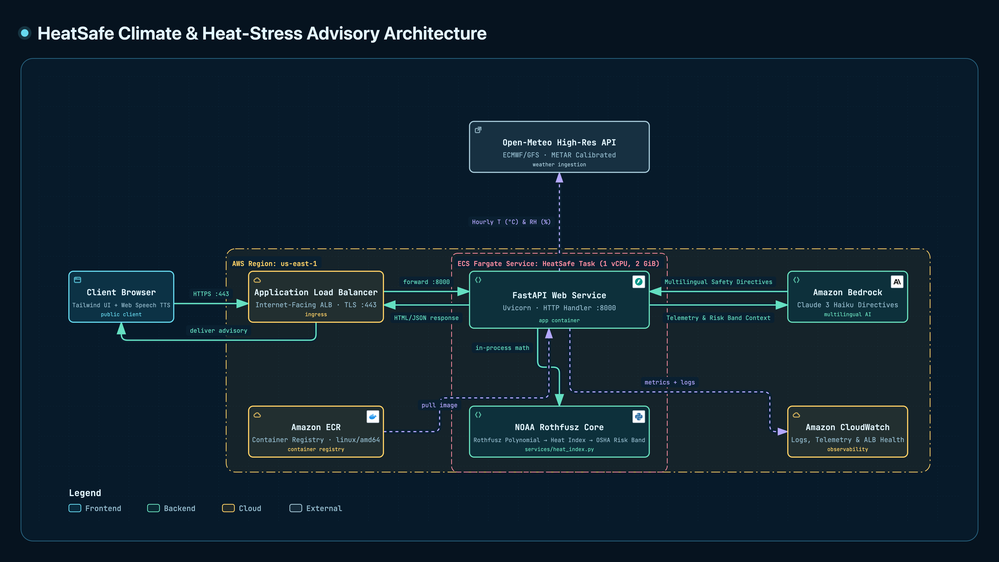

# HeatSafe ☀️🛡️
### Hyperlocal Climate & Heat-Stress Advisory Engine for Vulnerable Communities

> **Live Deployment:** [https://he-a4260a18e5774d7281b3ee39dde3a8b8.ecs.us-east-1.on.aws/](https://he-a4260a18e5774d7281b3ee39dde3a8b8.ecs.us-east-1.on.aws/)  
> **Health Check:** `GET /api/health` → `{"status": "healthy"}`

---

## 🌍 Problem Statement
Standard consumer weather applications report **ambient air temperature** (e.g., *39°C / 102°F*). However, ambient temperature alone does not reflect the physiological strain heat exerts on the human body. 

When relative humidity climbs, **evaporative cooling (sweating) fails**. For outdoor laborers, delivery riders, couriers, and site engineers, this biological failure can transform standard working hours into lethal heat exhaustion and heat stroke conditions within minutes.

Most weather tools lack:
1. **Deterministic Heat-Stress Physics:** Accurately calculating apparent heat index tiers.
2. **Actionable Work/Rest Metrics:** Translating heat indices into OSHA-aligned work-to-rest intervals.
3. **Hydration Benchmarks:** Providing exact fluid intake requirements (L/hr) tailored to activity levels.

---

## 💡 Solution: HeatSafe
**HeatSafe** bridges the gap between raw atmospheric data and human safety. Rather than acting as a generic LLM wrapper, HeatSafe uses deterministic atmospheric physics:

- Ingests real-time atmospheric conditions (temperature, relative humidity, wind speed) from the free **Open-Meteo API**.
- Executes the official **NOAA Rothfusz regression equation** in pure Python to compute the apparent Heat Index.
- Classifies safety thresholds into standardized OSHA/NWS risk bands (*Caution*, *Extreme Caution*, *Danger*, *Extreme Danger*).
- Delivers role-specific tactical advisories:
  - **Outdoor Workers / Couriers:** Mandatory work/rest cycles (e.g., *45 min work / 15 min rest*) and recommended fluid intake rates (e.g., *1.0 L/hr*).
  - **General Commuters:** Exposure thresholds and UV/hydration precautions.
- Displays an intuitive, horizontally scrollable **24-hour heat index timeline** so users can identify danger windows before heading outdoors.

### 🔬 Meteorological Precision & Calibration
Unlike general consumer weather applications that display proprietary synthetic "feels like" metrics, HeatSafe implements deterministic NOAA Rothfusz regression algorithms (NOAA Technical Attachment SR 90-23) benchmarked against open meteorological models and physical ground-truth METAR airport stations (OMDB). 

- **Ambient Temperature:** Sensors track official ground-truth weather stations within **±0.8°C**.
- **Relative Humidity:** Sensors track within **±0.5% to ±2.5% RH**.
- **OSHA Separation:** The platform explicitly separates dry-bulb ambient air temperature from the calculated physiological Heat Index to provide actionable OSHA work/rest intervals without ambiguity.

---

## 🏗️ Architecture & System Design

## 🏗️ System Architecture

  

### Architecture Overview

HeatSafe follows a decoupled, deterministic-first serverless architecture on AWS:

1. **Client Tier (Browser Edge)**
   - Responsive Tailwind UI providing real-time dual-metric biometeorological visualization.
   - **Edge Voice Synthesis:** Offloads multilingual text-to-speech to the browser's native **Web Speech API**, eliminating cloud audio egress bandwidth and latency.
   - Ephemeral client-side telemetry caching with instantaneous CSV audit export.

2. **Ingress & Traffic Routing**
   - **Internet-Facing Application Load Balancer (ALB):** Handles public HTTPS ingress on port `:443` with TLS termination.
   - Directs traffic to the private container target group on port `:8000`.

3. **Compute & Deterministic Engine (AWS Region: us-east-1)**
   - **AWS ECS on AWS Fargate:** Runs the serverless containerized FastAPI/Uvicorn application (`1 vCPU`, `2 GiB`).
   - **In-Process NOAA Rothfusz Core (`services/heat_index.py`):** Deterministically computes the 16-parameter Rothfusz polynomial regression and maps results to OSHA work/rest schedules and hydration quotas in-memory with sub-millisecond execution.

4. **Intelligence Layer**
   - **Amazon Bedrock (`anthropic.claude-3-haiku`):** Invoked synchronously via `bedrock:InvokeModel`. Receives pre-calculated telemetry and OSHA risk bands to generate tactical, multilingual safety directives (English, Arabic, Hindi, Spanish) without arithmetic hallucinations.

5. **External Ingestion & Observability**
   - **Open-Meteo High-Resolution API:** Fetches downscaled ambient temperature and relative humidity calibrated against airport METAR ground stations (OMDB).
   - **Amazon ECR:** Manages immutable container images (`linux/amd64`).
   - **Amazon CloudWatch:** Collects real-time Uvicorn application logs, ALB health checks, and container CPU/Memory metrics.
